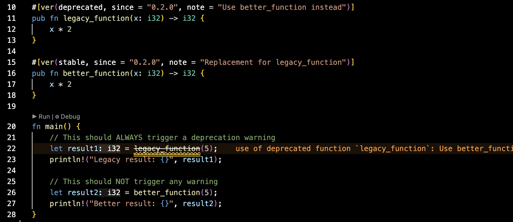
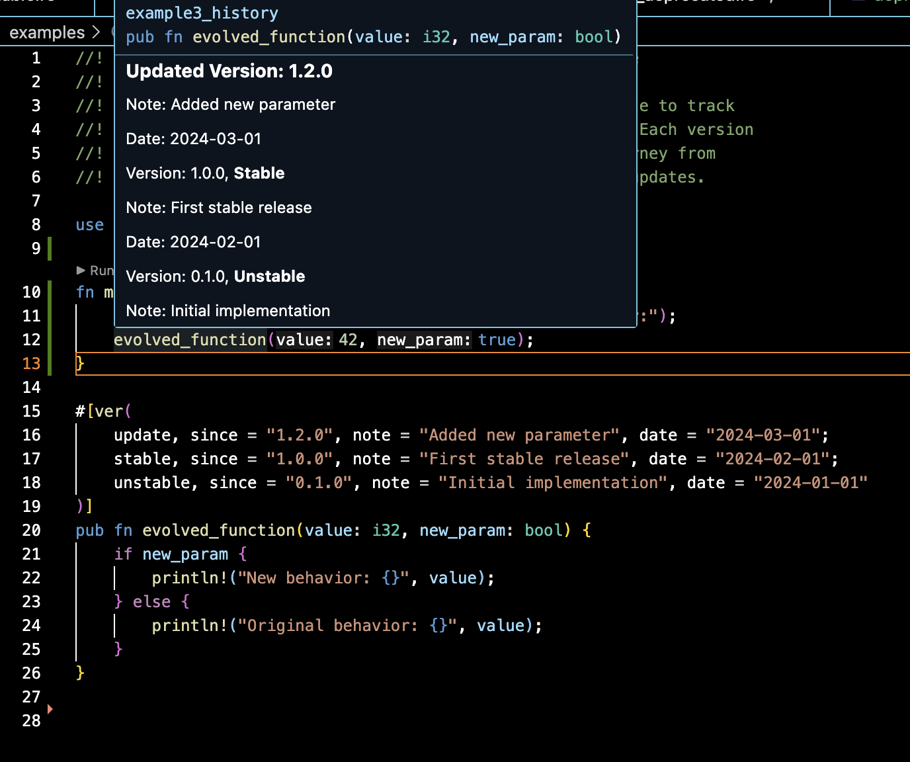

# AV - API Versioning Macro

A Rust procedural macro for tracking API version history and deprecation warnings.

## Features

- Track multiple version entries per function/struct
- Auto-generate documentation from version history
- Auto-generate warnings based on version status

## Version Types

- **`unstable`** - Generates warning when `deprecated_for_unstable` feature is enabled (controlled by API developer)
- **`stable`** - No warnings
- **`update`** - No warnings
- **`deprecated`** - Always generates `#[deprecated]` warning

## Usage

```rust
use av::ver;

// Unstable API
#[ver(unstable, since = "0.1.0")]
pub fn unstable_example() { }

// Stable API
#[ver(stable, since = "1.0.0")]
pub fn stable_example() { }

// Deprecated API - always generates warning
#[ver(deprecated, since = "2.0.0", note = "Use new_function instead")]
pub fn old_function() { }

// Full - multiple versions with history
#[ver(
    update, since = "1.2.0", note = "Added parameter", date = "2024-03-01", author = "Akari";
    stable, since = "1.1.0", note = "First stable release", date = "2024-02-01", author = "Akari";
    unstable, since = "0.1.0", note = "Initial implementation", date = "2024-01-01", author = "Akari"
)]
pub fn full_example(value: i32, new_param: bool) { }
```

## Screenshots

**Deprecated Warning:**


**Generated Documentation:**


